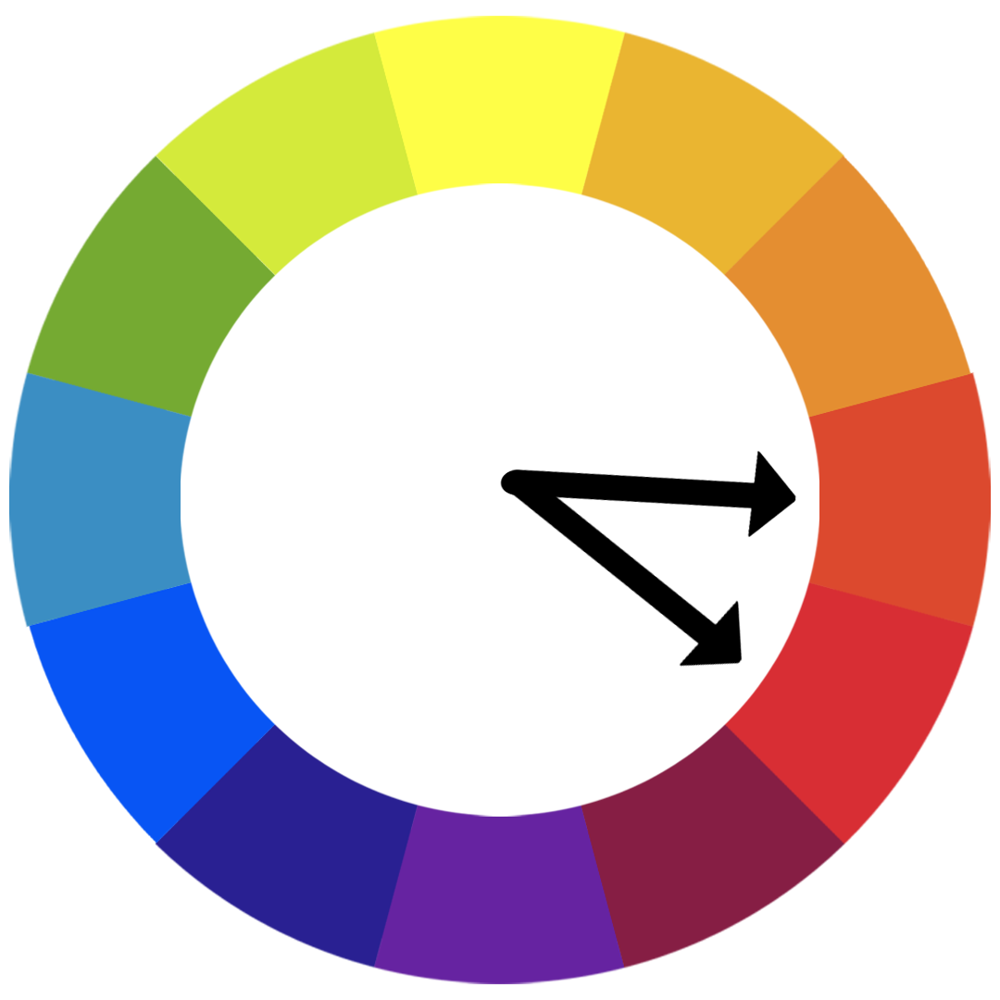
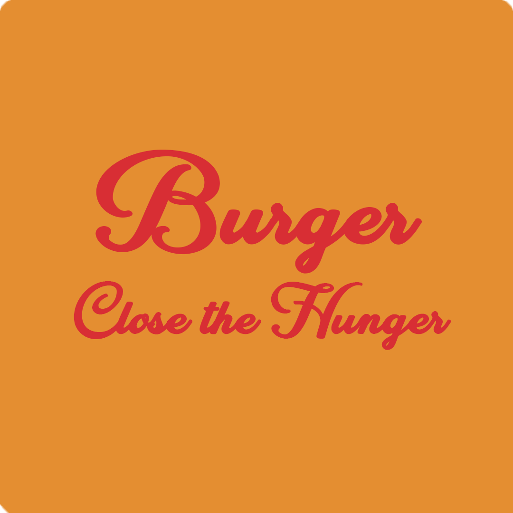
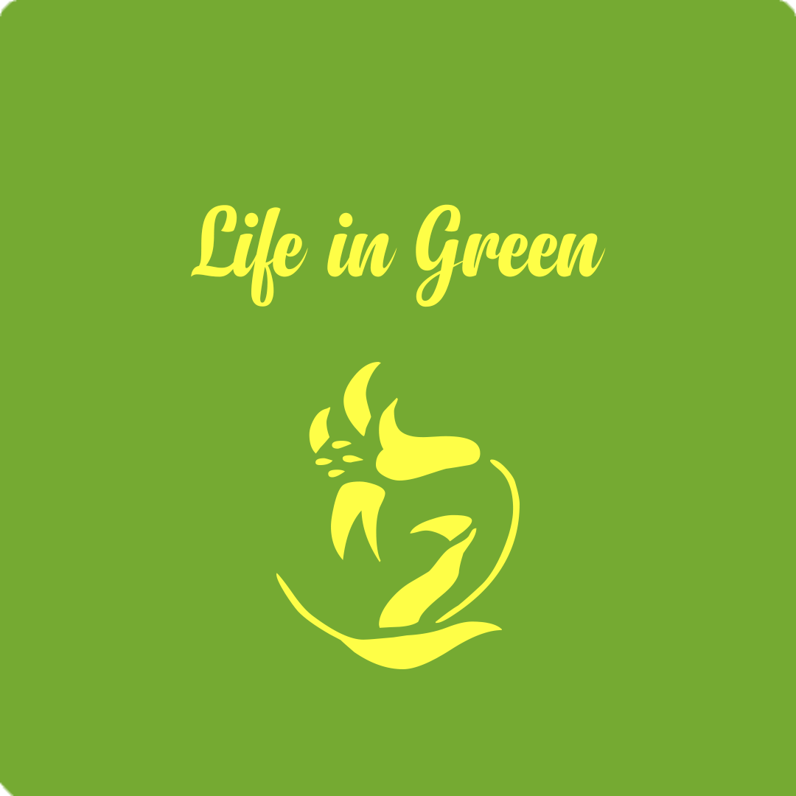
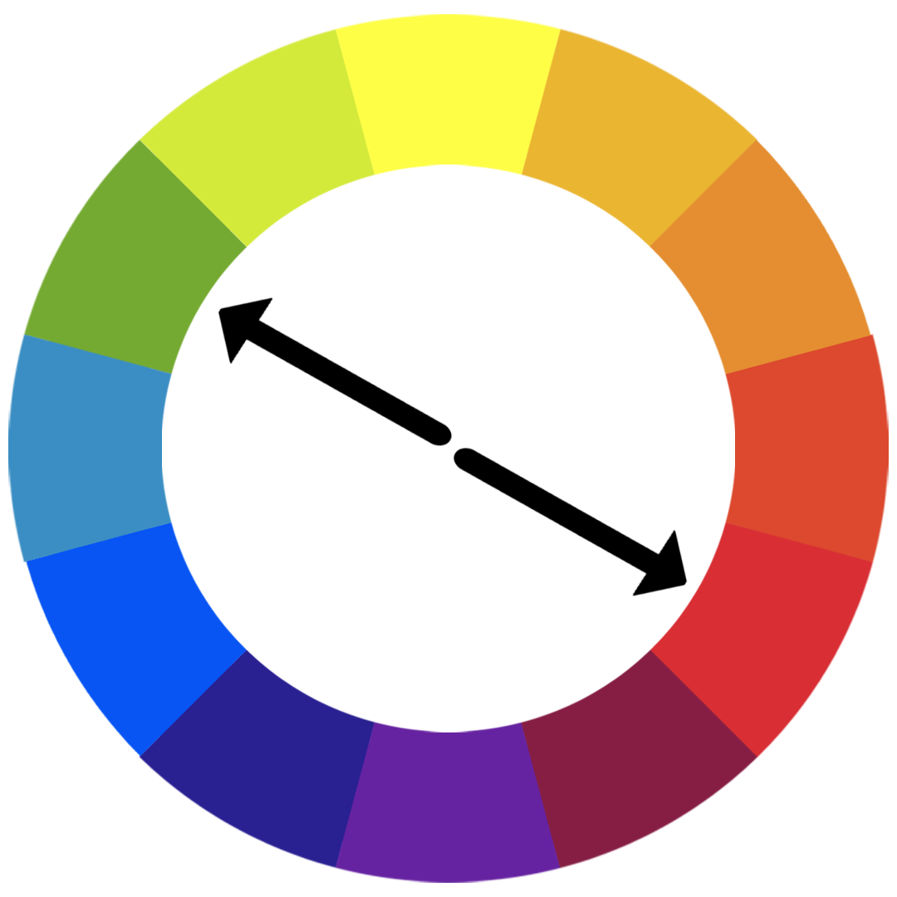
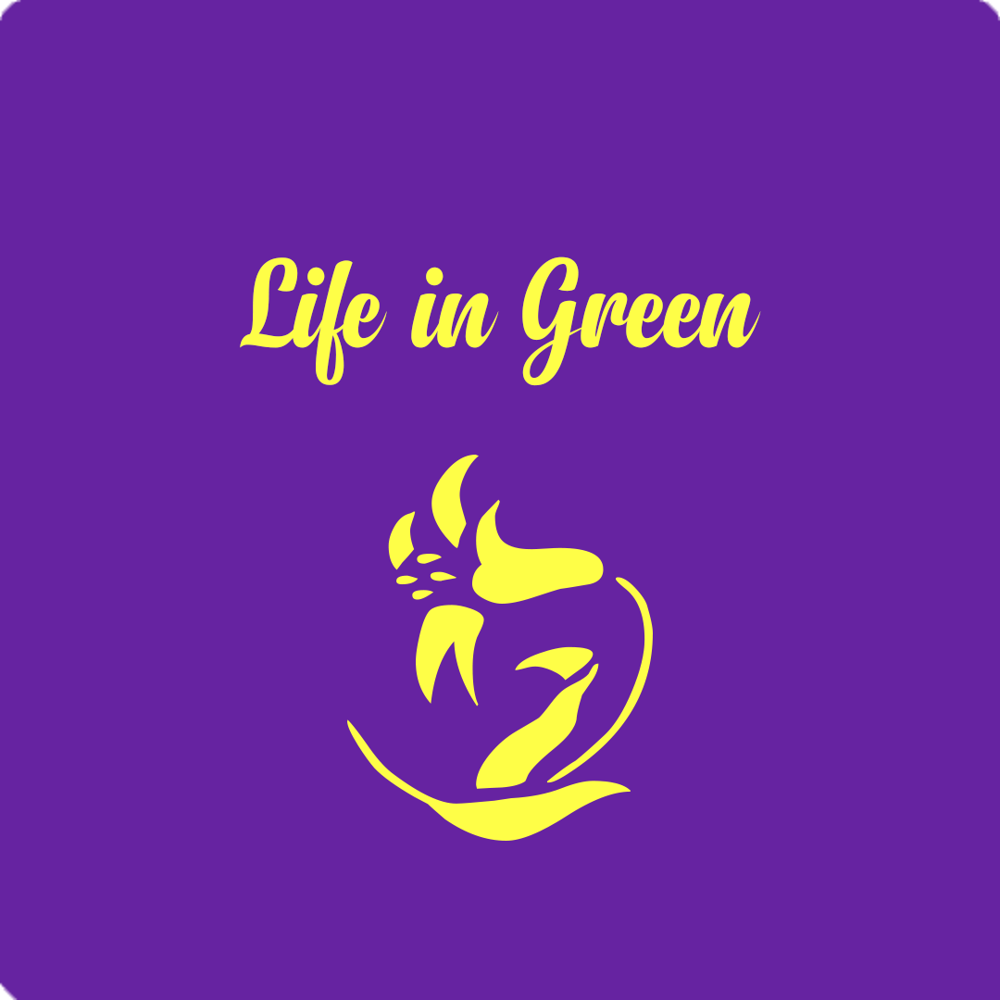
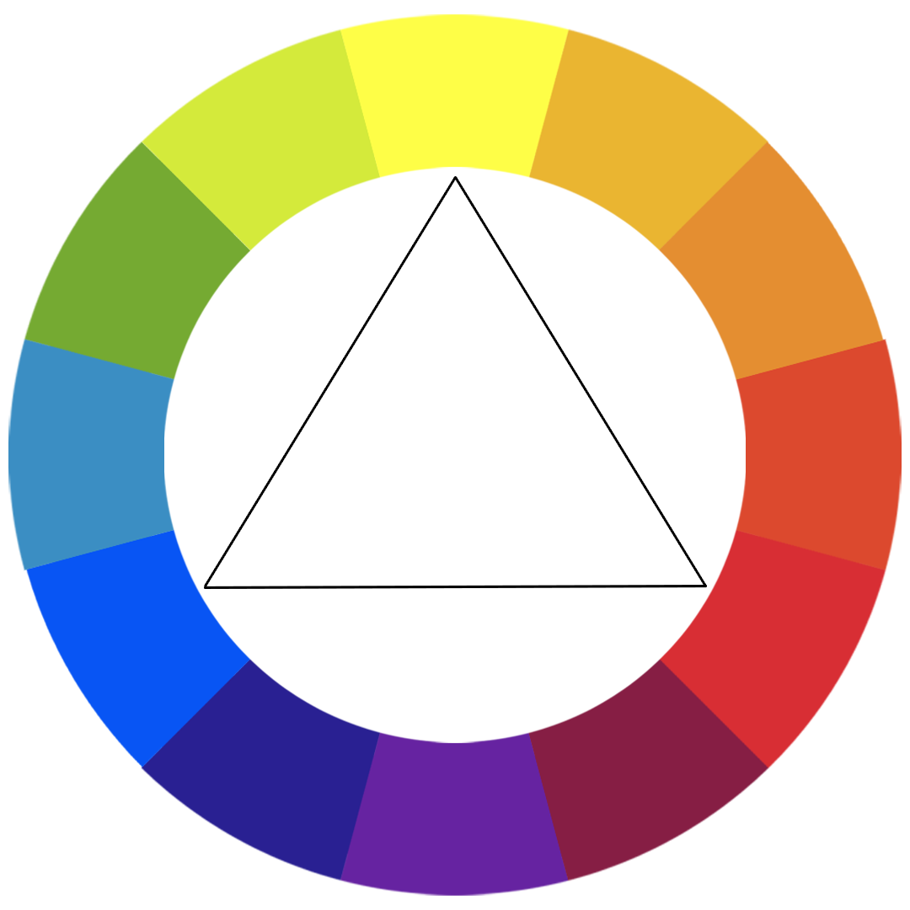
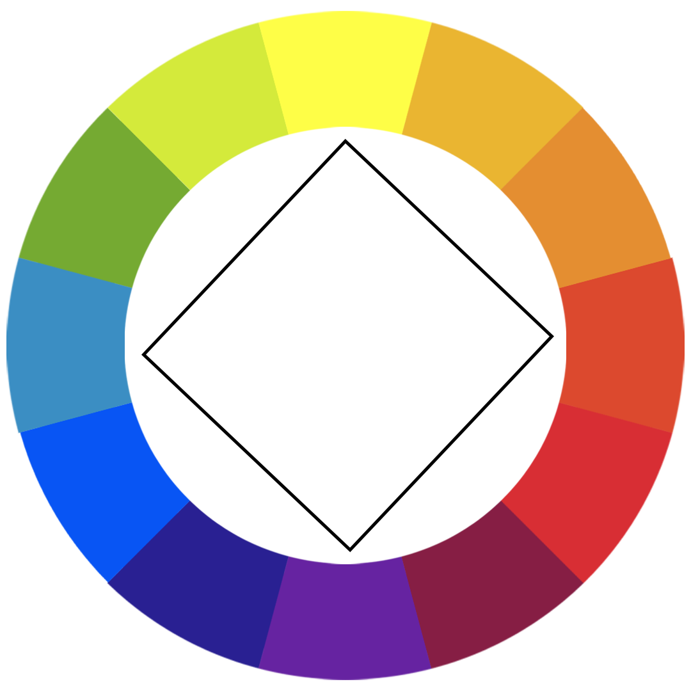
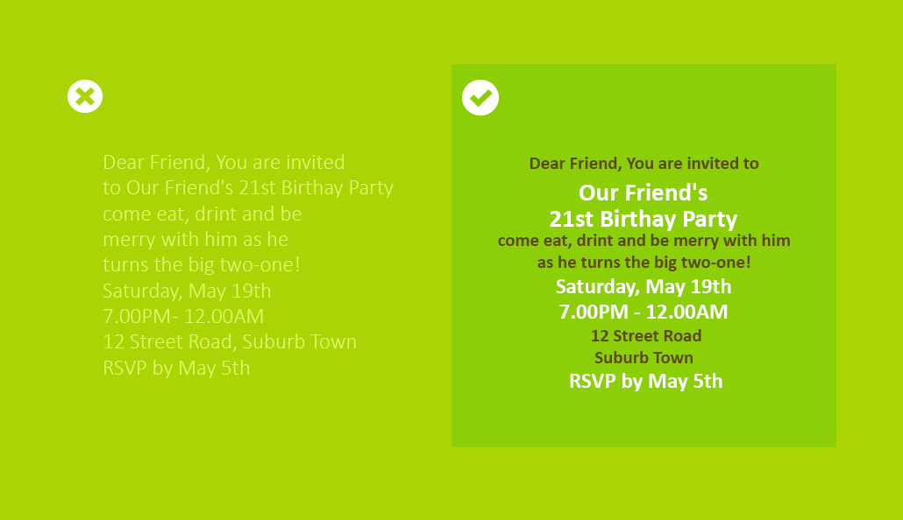
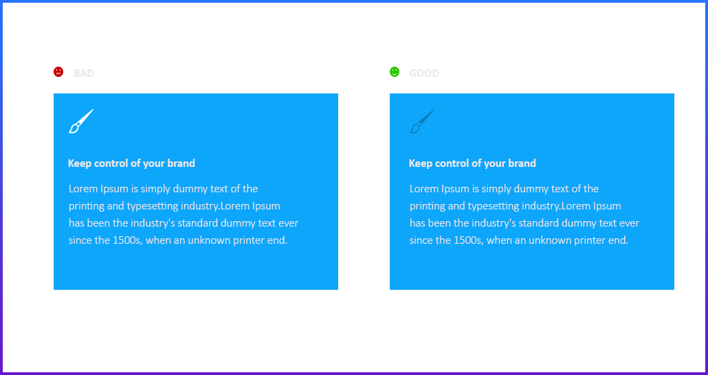
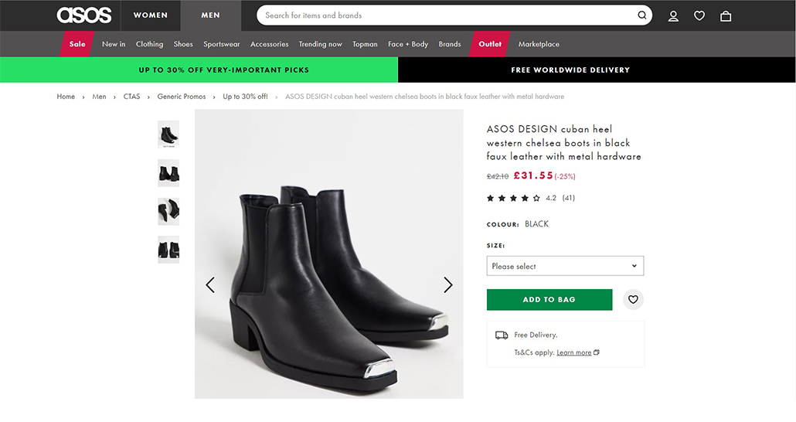

# Web Design School
There are 4 Design Principles
1. Color Theory
2. Typography
3. User Interface Design (UI)
4. User Experience Design (UX)

<h2 align=center>Color Theory</h2>

<h4>Moods</h4>
- Red     : 🔥   - Love, Energy, Intensity
- Yellow  : 🌞  - Joy, Intellect, Attention
- Green   : 🍀  - Freshness, Safety, Growth
- Blue    : 💧   - Stability, Trust, Serenity
- Purple  : 👑  - Royalty, Wealth, Femininity

<h6>Analogous Colors</h6>

Very next color

Examples

<h6>Complementary Colors</h6>

Opposite colors gives the pop up style   example: Meat shop, packed with green bushes around the Meat

Examples

<h6> Colors</h6>

other schemes

<h6>For more</h6>
Vsit: <a href="https://color.adobe.com/create/color-wheel">Adobe Colors</a>, <a href="https://colorhunt.co/">Color hunt</a>

<h2 align=center>User Interface</h2>
1. Hierarchy  
2. Layout  
3. White Spaces (Around objects)  
4. Audience  

<h4>1. Hierarchy</h4>

<h4>Colors</h4>

<h4>Examples</h4>

<h4>2. Layout</h4>

<h4>3. White Spaces (Around objects)</h4>

<h4>4. Audience</h4>

