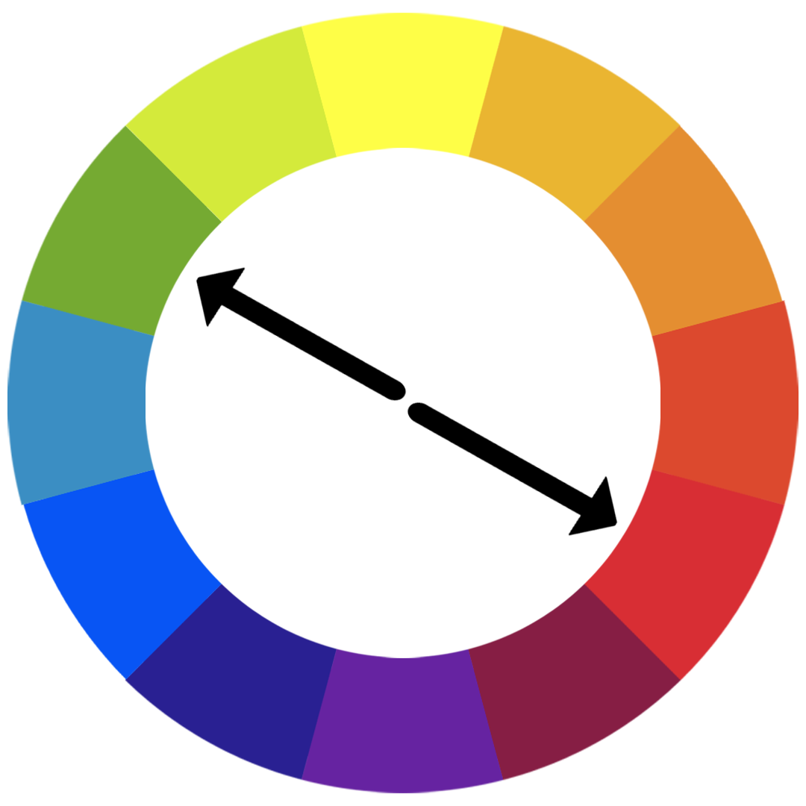
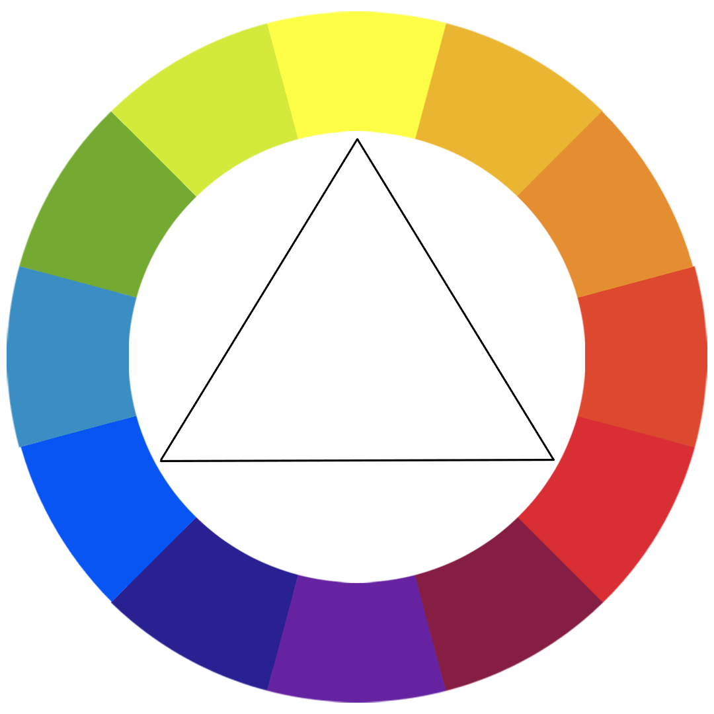

## Color Theory
### Moods
- Red     : 🔥   - Love, Energy, Intensity
- Yellow  : 🌞  - Joy, Intellect, Attention
- Green   : 🍀  - Freshness, Safety, Growth
- Blue    : 💧   - Stability, Trust, Serenity
- Purple  : 👑  - Royalty, Wealth, Femininity

<h6>Analogous Colors</h6>

Very next color

Examples

<h6>Complementary Colors</h6>

Opposite colors gives the pop up style   example: Meat shop, packed with green bushes around the Meat

Examples

<h6> Colors</h6>

other schemes

<h6>For more</h6>
- <a href="https://color.adobe.com/create/color-wheel">Adobe Colors</a>
- <a href="https://colorhunt.co/">Color hunt</a>
